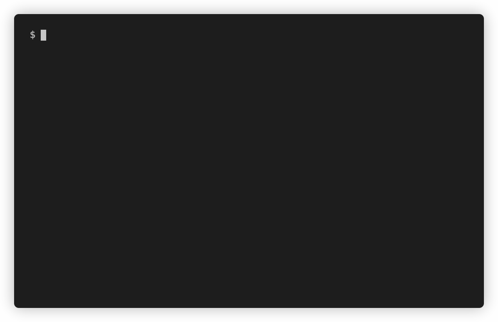

# jest-it-up

[](https://www.npmjs.com/package/jest-it-up)
[](https://github.com/rbardini/jest-it-up/actions)
[](https://codecov.io/gh/rbardini/jest-it-up)
[](https://david-dm.org/rbardini/jest-it-up)
[](https://david-dm.org/rbardini/jest-it-up?type=dev)

Ensure incremental coverage gains are not lost, and positively reinforce good testing habits. Automatically bump up global Jest thresholds whenever coverage goes above them.



## Requirements

- Node.js 12+
- Conventional `jest.config.js` (`package.json` config unsupported)
- `json-summary` coverage report (see [usage](#usage))

## Installation

```console
npm install --save-dev jest-it-up
```

## Usage

jest-it-up exposes a standalone CLI tool (see [options](#options)), but you most likelly want to use it in a post-test script.

Within `package.json`:

```js
{
  "scripts": {
    "test": "jest --coverage", // or set `collectCoverage` to `true` in Jest config
    "posttest": "jest-it-up" // must run from the same directory as `jest.config.js`
  }
}
```

within `jest.config.js`:

```js
module.exports = {
  coverageReporters: [
    'json-summary' // plus any other reporters, e.g. "lcov", "text", "text-summary"
  ],
  coverageThreshold: {
    global: {
      branches: 0, // or your current numbers
      functions: 0,
      lines: 0,
      statements: 0
    }
  }
}
```

Once tests finish running, jest-it-up will update configured thresholds to match higher coverage numbers, if any.

## Options

```console
$ jest-it-up --help
Usage: jest-it-up [options]

Options:
  -m, --margin <margin>  minimum threshold increase (default: 0)
  -i, --interactive      ask for confirmation before applying changes
  -s, --silent           do not output messages
  -d, --dry-run          process but do not change files
  -v, --version          output the version number
  -h, --help             display help for command
```
